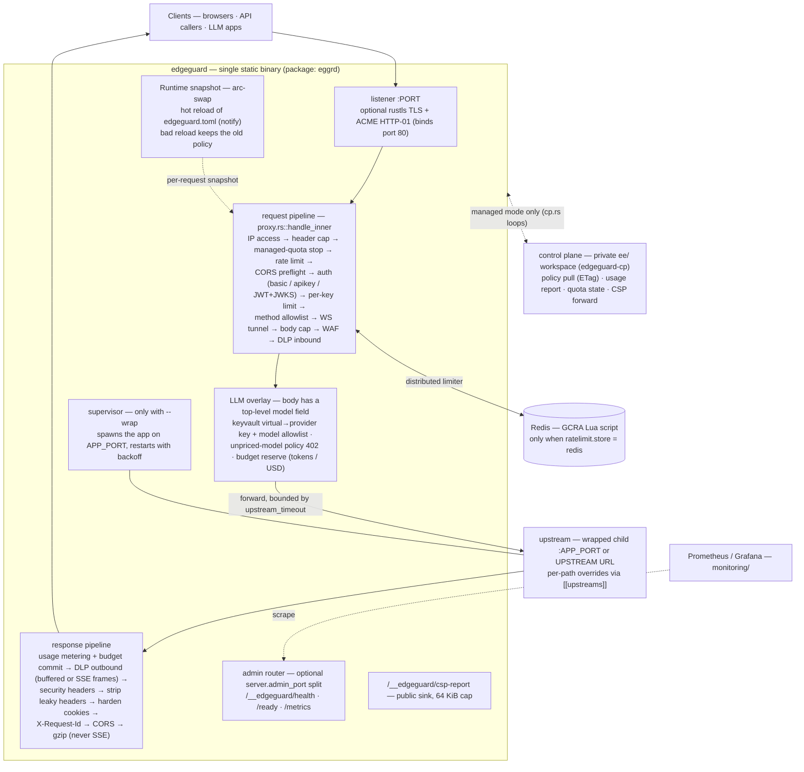
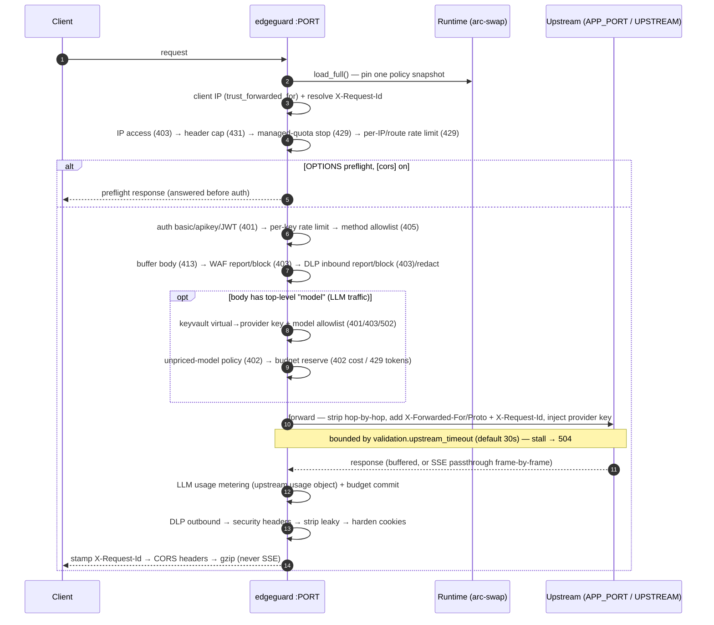
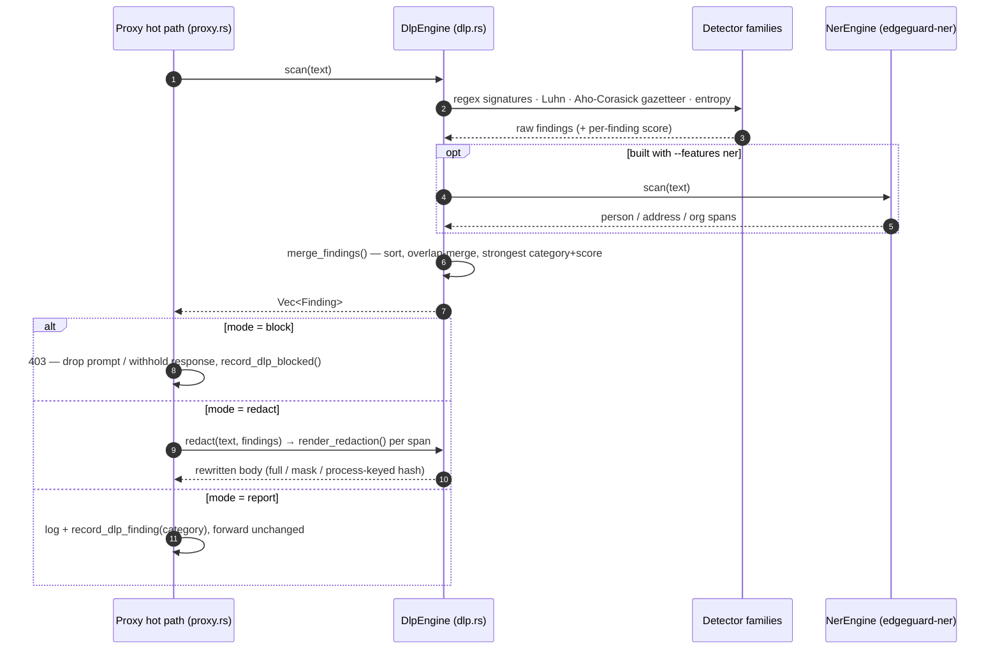
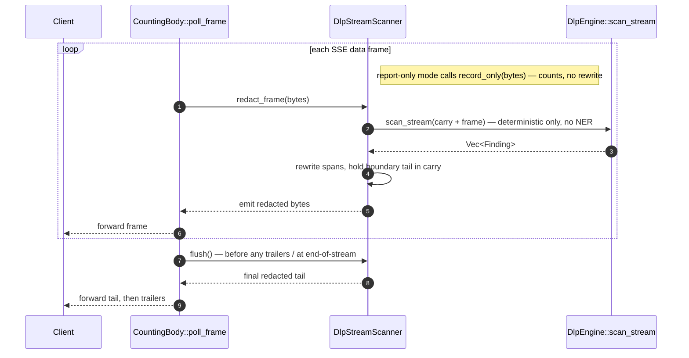

# EdgeGuard

A drop-in Rust edge proxy that gives any HTTP app a secure front door — **authentication,
rate limiting, TLS, and hardened response headers** — with secure-by-default config and
**zero code changes** to the upstream app.

It's the missing front door for apps that were generated (vibe-coded) without one.
EdgeGuard owns the request path (auth, rate-limit, validation) and the response path
(CSP/HSTS/cookie hardening) in a single static binary.

[](#license)

> **Status: v0 shipped, v1 landed, v2 landed, v2.5 underway.** The barebone v0 slice is stable;
> the **v1** (self-hostable & production-usable) feature set below has landed and is tested
> in-process. The one exception is **ACME**, which is implemented and compiled but can only be
> proven against a live CA (see [Platform support](#tls--acme)). The **v2 (WAF-lite)** phase has
> landed: [input inspection](#waf-lite-input-rules) (off by default), a [shared-store rate
> limiter](#distributed-rate-limiting) for multi-replica deployments, and an optional
> [public/private split](#publicprivate-split) for the ops endpoints. (The Redis limiter
> backend, like ACME, is compiled but proven only against a live store.) **v2.5 (static/edge
> surface)** is underway: an [`edgeguard generate`](#static--edge-hosts) config generator for
> static hosts and a [Rust→WASM Cloudflare Worker](worker/README.md) (the worker, like ACME and
> Redis, compiles but is proven only against a live deploy). Codename "EdgeGuard" is a working
> title — see the [roadmap](docs/ROADMAP.md).

## Where it fits

EdgeGuard is a **reverse proxy you put directly in front of one app** — the secure front door
between the public internet (or your platform's load balancer) and your application process. It
terminates/authenticates the request, forwards it to your app *unchanged*, and hardens the
response on the way back.

```text
         public internet
    (clients · bots · scanners)
               │   :443 / :8080
               │   TLS · auth · rate-limit · WAF · request validation
               ▼
       ┌──────────────────┐
       │     EdgeGuard     │   ◀── this project (the secure front door)
       └──────────────────┘
               │   plain HTTP on APP_PORT, localhost only
               │   CSP · HSTS · cookie hardening · leaky-header stripping on the way back
               ▼
       ┌──────────────────┐
       │      your app     │   ◀── unchanged (Node / Python / Go / Rust / …)
       └──────────────────┘
               │
               ▼
        DB · internal APIs
```

In the larger picture it sits **between your edge (CDN / platform LB / DNS) and your app** — one
hop, one upstream:

```text
  DNS ─▶ [ CDN / platform LB ] ─▶ [ EdgeGuard ] ─▶ [ your app ] ─▶ [ DB / internal APIs ]
          optional: caching, DDoS    this project     unchanged
```

Run it as the container **entrypoint that wraps your app**, or as a **separate front service**
pointing at an upstream URL — see [Two deployment modes](#two-deployment-modes).

### What it does *not* replace

EdgeGuard is a focused security front door, not a platform. It does **not** replace:

- **Your CDN / DDoS edge** (Cloudflare, Fastly, CloudFront) — it hardens one origin; no global
  caching, anycast, or volumetric DDoS absorption. Run it *behind* the CDN.
- **A full WAF** (ModSecurity, Coraza, AWS WAF) — the built-in [WAF-lite](#waf-lite-input-rules)
  is heuristic and off by default: signatures, not a managed rule feed.
- **An identity provider** (Auth0, Keycloak, Cognito) — it *verifies* tokens (JWT/JWKS) and gates
  with Basic / API-key; it doesn't issue tokens, manage users, or run OAuth flows.
- **An API gateway / service mesh** (Kong, Istio, Envoy mesh) — one upstream, no service
  discovery, routing fabric, or request transformation beyond the security pipeline.
- **Your app's own authorization** — it's a coarse front-door gate (is this request allowed in at
  all); per-user / per-resource permissions still live in your app.
- **Platform-terminated TLS** — on most PaaS you leave TLS off and let the platform manage certs;
  TLS termination here is for the VPS / front-proxy path.

### Moving an existing app behind it

- **Exposed directly today, no proxy** (a Node/Python/Go server on a VPS or PaaS): make EdgeGuard
  the entrypoint and bind your app to `APP_PORT` (localhost). One Dockerfile change (see
  [`examples/`](examples/)) and the app gains auth + rate-limit + headers with **zero code
  changes** — your app stops listening on the public port, EdgeGuard does.
  ```bash
  # before:  node server.js                      # app listens on $PORT, public
  # after:   EdgeGuard binds $PORT, runs the app on APP_PORT
  PORT=8080 APP_PORT=3000 edgeguard --config edgeguard.toml --wrap "node server.js"
  ```
- **Behind plain nginx / Caddy** (TLS + reverse proxy only, no auth/limits): drop EdgeGuard
  between that proxy and the app, or replace the proxy — point `UPSTREAM` at your app and let
  EdgeGuard own TLS too.
  ```bash
  UPSTREAM=http://127.0.0.1:3000 edgeguard --config edgeguard.toml
  ```
- **Coming off a hosted gate** (oauth2-proxy + nginx, or Cloudflare Access in front): EdgeGuard
  folds the auth gate + rate-limit + header hardening into one static binary next to the app —
  fewer moving parts, no extra network hop, self-hostable and portable across providers.
- **Static / edge host** (Vercel, Netlify, Cloudflare Pages) where you can't run a long-lived
  proxy: use [`edgeguard generate`](#static--edge-hosts) to emit the hardening config, or the
  [Cloudflare Worker](worker/README.md) for auth + hardening at the edge.

## What it does

- **Reverse proxy** to one upstream (a wrapped child process, or an external URL).
- **Streaming / LLM-proxy passthrough** (`validation.stream_passthrough`, off by default):
  forward `text/event-stream` (SSE) responses **unbuffered, frame-by-frame** — so EdgeGuard fronts
  **streaming LLM backends** (OpenAI-compatible token streams) and any SSE app without collapsing
  time-to-first-byte. Egress bytes are still counted as frames flow.
- **WebSocket / `Upgrade` passthrough** (`validation.websocket_passthrough`, off by default):
  forward an authenticated, rate-limited upgrade request intact and splice the connections into a
  raw bidirectional tunnel on the upstream's `101` — so EdgeGuard fronts WebSocket apps (chat,
  live dashboards, dev HMR). Off by default because the normal path strips the hop-by-hop
  `Upgrade` header.
- **IP access control** (`[access]`, allow-all by default): coarse CIDR allow/deny lists evaluated
  by client IP before auth and rate limiting — lock the app to an office/VPN range, or drop an
  abusive subnet.
- **Request IDs** (`X-Request-Id`): reuse a well-formed inbound id or mint a UUID v4, forward it
  upstream, echo it on every response, and tag the access log with it — one id correlates the
  client, EdgeGuard, and the app.
- **Per-path upstreams** (`[[upstreams]]`, single upstream by default): a static path-prefix map
  so `/api` can go to a backend and everything else to a static frontend (longest prefix wins).
- **Response compression** (`validation.compress_responses`, off by default): gzip for clients
  that ask, skipping already-compressed types and (always) SSE streams.
- **Co-process supervisor**: launches your app, restarts it on crash, and forwards
  termination signals on shutdown (acts as a tiny container init). *Full process-group
  signaling on Unix; best-effort child kill on Windows.*
- **Authentication** — pick one gate via `auth.mode`:
  - **HTTP Basic** (plaintext for dev, or `$argon2` PHC hashes);
  - **static API key / bearer token** (constant-time compare, `Authorization: Bearer` or
    `X-API-Key`);
  - **JWT** (HS/RS/ES/PS/EdDSA) with a static key or a fetched, cached **JWKS** (keys
    selected by `kid`; the configured algorithm is pinned to block `alg` substitution).
- **Rate limiting** (GCRA), returns `429`: a global **per-IP** limit, optional **per-route**
  overrides (longest-prefix match), and an optional **per-key** limit keyed by the authenticated
  principal — backed by the in-process `governor` limiter or, for multi-replica deployments, a
  shared **Redis** store so N instances enforce one global limit.
- **WAF-lite input inspection** (`[waf]`, **off by default**): heuristic **SQLi / XSS /
  path-traversal** rulesets plus operator-defined **deny patterns**, with a **report-only**
  rollout mode. A match is logged and counted (`edgeguard_waf_hits_total`); in `block` mode it
  returns `403`. Screens the URL path/query by default (also percent-decoded); headers and body
  are opt-in.
- **Edge DLP — PII / secret redaction** (`[llm.dlp]`, **off by default**): an inline guardrail on the
  LLM proxy that scans the **prompt** sent to the model and the **completion** sent back for PII and
  secrets — emails, cards (Luhn-gated), SSN/phone/IBAN, API keys & private-key blocks, an
  Aho-Corasick **gazetteer** deny-list, an **entropy** catch-all, plus optional ONNX **NER** for
  names/addresses/orgs (`--features ner`). A **report / block / redact** ladder like the WAF;
  redaction is `full` / `mask` / process-keyed `hash` and also runs on streamed SSE frame-by-frame.
  See [Edge DLP](#edge-dlp-pii--secret-redaction).
- **CORS** (`[cors]`, **off by default**): answer browser **preflight** `OPTIONS` requests (before
  auth — preflights carry no credentials) and decorate responses with the matching
  `Access-Control-*` headers, so a separate-origin frontend can call the app. A credentialed
  wildcard is rejected at startup.
- **TLS termination** via `rustls`, with optional **ACME / Let's Encrypt** (HTTP-01)
  automatic certificates.
- **Prometheus metrics** at `/__edgeguard/metrics` (request rate by outcome, rate-limit
  hits, WAF hits, DLP findings by category + blocks, latency histogram, CSP reports).
- **Public/private split** (optional): serve the internal `/__edgeguard/*` ops endpoints
  (health, readiness, metrics) on a separate **private listener** so they aren't exposed on the
  public port.
- **Config hot-reload**: edit the config file and policy swaps in atomically — no dropped
  connections, and a broken edit is rejected without taking the proxy down.
- **Response hardening**: injects CSP (with **report-only** mode + a violation **report
  sink**), HSTS, `X-Content-Type-Options`, `X-Frame-Options`, `Referrer-Policy`,
  `Permissions-Policy`; forces `Secure; HttpOnly; SameSite` on `Set-Cookie`; strips leaky
  headers (`Server`, `X-Powered-By`).
- **Static & edge output** (`edgeguard generate`): emit the response-hardening policy as a
  `_headers` file / `vercel.json` / edge-middleware snippet for static hosts, or run the
  [Cloudflare Worker](worker/README.md) edge build (hardening **+** auth) where the proxy can't.
- **Body-size limit** (`413`), **header-size limit** (`431`), and **method allowlist**
  (`405`).
- **Env-first config** (`PORT` / `APP_PORT` / `UPSTREAM`) with an optional TOML overlay.
- **Structured JSON access logs** and `/__edgeguard/health` + `/__edgeguard/ready`
  endpoints.

## Two deployment modes

1. **Co-process (default for PaaS/VPS)** — EdgeGuard is the container entrypoint, binds the
   platform's `$PORT`, and runs your app on `APP_PORT`:
   ```bash
   edgeguard --config edgeguard.toml --wrap "node server.js"
   ```
2. **Front proxy (separate service)** — point EdgeGuard at an external upstream:
   ```bash
   UPSTREAM=http://app.internal:3000 edgeguard --config edgeguard.toml
   ```

## Quickstart (local)

The fastest path is to let EdgeGuard scaffold itself in your app's repo, then validate the config
before you run it:

```bash
edgeguard init                       # writes edgeguard.toml + Dockerfile.edgeguard (detects Node/Python/Go/Rust)
echo -n 'your-password' | edgeguard --hash   # paste the $argon2id$… into edgeguard.toml
edgeguard doctor --config edgeguard.toml     # validate + warn on foot-guns (exits non-zero on errors)
```

Or build and wrap an app directly:

```bash
cargo build --release

# Wrap any app that reads PORT from the env. EdgeGuard sets PORT=$APP_PORT for it.
PORT=8080 APP_PORT=3000 ./target/release/edgeguard \
  --config edgeguard.toml \
  --wrap "node server.js"
```

On a successful start you get JSON log lines ending in (fields elided):

```json
{"level":"INFO","fields":{"message":"upstream is ready","port":3000},...}
{"level":"INFO","fields":{"message":"EdgeGuard listening","listen":"0.0.0.0:8080","upstream":"http://127.0.0.1:3000","auth":"basic","rate_limit":true},...}
```

Then hit it with the credential you configured (a request without one gets `401`):

```console
$ curl -s -o /dev/null -w '%{http_code}\n' http://localhost:8080/
401
$ curl -u admin:your-password http://localhost:8080/
<your app's normal response, now with CSP/HSTS/X-Frame-Options headers injected>
```

> ⚠️ The shipped config requires you to set a credential before it will authenticate —
> the default `users` value is a non-working placeholder. **Before exposing anything**,
> replace it with an `$argon2` hash (see [Configuration](#configuration)).

## Onboard an app with `edgeguard init` and `edgeguard doctor`

These two commands take you from "an app with no front door" to "a validated, secure-by-default
config" without hand-writing TOML or reading this whole README. Run them from your app's repo root.

### 1. Scaffold the config — `edgeguard init`

`init` detects your app's runtime from the files in the directory (Node / Python / Go / Rust) and
writes two files:

```bash
$ edgeguard init
Detected runtime: Node.js
Wrote edgeguard.toml and Dockerfile.edgeguard.

Next steps:
1. Set a real credential — the shipped edgeguard.toml ships a non-working placeholder:
     echo -n 'your-password' | edgeguard --hash
     ...
```

- **`edgeguard.toml`** — the annotated, secure-by-default config reference (the *same* one
  documented below, embedded into the binary so it can't drift).
- **`Dockerfile.edgeguard`** — a wrap-your-app Dockerfile that copies the `edgeguard` binary from
  the published image and makes it your container entrypoint (binding `$PORT`, running your app on
  `APP_PORT`), tailored to the detected runtime.

`init` **never overwrites** an existing `edgeguard.toml` or `Dockerfile.edgeguard` — re-run with
`edgeguard init --force` if you actually want to regenerate them.

### 2. Set a real credential

The shipped config ships a deliberately **non-working** placeholder so nothing is exposed by
accident. Replace it with an Argon2id hash (the helper reads the password on stdin, so it never
lands in your shell history or the process list):

```bash
echo -n 'your-password' | edgeguard --hash
# → $argon2id$v=19$m=19456,t=2,p=1$<salt>$<hash>
```

Paste that string as the user's value in `edgeguard.toml`:

```toml
[auth]
mode = "basic"
users = { admin = "$argon2id$v=19$m=19456,t=2,p=1$..." }
```

### 3. Validate before you deploy — `edgeguard doctor`

`doctor` loads your config through the **exact same path the proxy uses** (so it can't drift from
real startup) and then lints for the foot-guns people actually ship. It exits non-zero on a hard
error, so you can gate a deploy with it in CI.

Run it against the freshly-scaffolded config and it will flag the still-placeholder credential:

```bash
$ edgeguard doctor --config edgeguard.toml
✗ [error] auth.users["admin"] is not a valid argon2 hash (the shipped placeholder?): no one can
  authenticate. Run `edgeguard --hash` and paste the result.
ℹ [info] tls.enabled = false: EdgeGuard serves plain HTTP. Fine when your platform terminates TLS
  in front of it; ...

1 error(s), 0 warning(s)
$ echo $?
1
```

Once you've pasted a real hash, it comes back clean:

```bash
$ edgeguard doctor --config edgeguard.toml
ℹ [info] tls.enabled = false: ...

0 error(s), 0 warning(s)
$ echo $?
0
```

`doctor` checks, among others: the placeholder/plaintext credential, `auth.mode = "none"` on a
public port, secrets committed to the file (prefer the env vars / `*_FILE`), an over-permissive or
credentialed-wildcard CORS policy, a `redis` limiter store with no URL, and `enforce_quota` without
managed mode. Wire it into CI to fail the build on a misconfiguration:

```yaml
# .github/workflows — fail the pipeline on a bad EdgeGuard config
- run: edgeguard doctor --config edgeguard.toml
```

### 4. Run it

```bash
# Co-process (the generated Dockerfile does this for you):
PORT=8080 APP_PORT=3000 edgeguard --config edgeguard.toml --wrap "npm start"

# now hit it with the credential you set
curl -u admin:your-password http://localhost:8080/
```

That's the whole loop: **`init` → `--hash` → `doctor` → run**. Editing `edgeguard.toml` while
EdgeGuard is running hot-reloads the policy in place (see [Configuration](#configuration)).

## Project layout

```text
.
├── Cargo.toml
├── edgeguard.toml        # annotated config reference (secure defaults)
├── README.md
├── CHANGELOG.md
├── CONTRIBUTING.md
├── LICENSE               # Apache-2.0
├── src/
│   ├── main.rs           # CLI (serve / init / doctor / --hash / generate), bootstrap, shutdown
│   ├── config.rs         # env-first config + TOML overlay, size/rate parsing
│   ├── proxy.rs          # request/response pipeline (auth, limit, hardening, WS tunnel)
│   ├── access.rs         # IP allow/deny CIDR matching (`[access]`)
│   ├── cors.rs           # CORS preflight + response decoration (`[cors]`)
│   ├── doctor.rs         # config linter (`edgeguard doctor`)
│   ├── scaffold.rs       # project scaffolding (`edgeguard init`)
│   ├── generate.rs       # static-host / edge config generator (`edgeguard generate`)
│   └── supervisor.rs     # co-process supervisor (Unix signals / Windows fallback)
├── docs/
│   ├── CONFIG.md         # complete configuration reference (every flag/env/TOML key)
│   ├── API.md            # endpoints, proxy-added headers/status codes, metrics
│   ├── OPERATIONS.md     # ops runbook: deploy, state, monitoring, troubleshooting
│   ├── REQUIREMENTS.md   # product requirements & scope
│   ├── DEPLOYMENT.md     # deployment & integration strategy
│   └── ROADMAP.md        # phased dev plan → OSS launch → product roadmap
├── examples/
│   ├── Dockerfile.node   # wrap-your-app template (Node)
│   ├── Dockerfile.python # wrap-your-app template (Python)
│   ├── docker-compose.yml # front EdgeGuard + app (file-mounted secrets)
│   ├── edgeguard.service # systemd unit (VPS / front-proxy path)
│   ├── render.yaml       # Render blueprint
│   └── fly.toml          # Fly.io config
└── worker/               # Rust→WASM Cloudflare Worker (edge build; detached crate)
```

## Configuration

All config is optional; EdgeGuard ships secure defaults. **The complete reference —
every CLI flag, env var, and TOML key (including the whole `[llm]` overlay), with types,
defaults, and hot-reload rules — is [docs/CONFIG.md](docs/CONFIG.md).** The shipped
[`edgeguard.toml`](./edgeguard.toml) is the annotated starter for the front-proxy
sections. Environment overrides:

| Env | Meaning | Default |
|---|---|---|
| `PORT` | public listen port | `8080` |
| `APP_PORT` | internal port for the wrapped app | `3000` |
| `ADMIN_PORT` | private listener for the ops endpoints (overrides `server.admin_port`) | `0` (off) |
| `UPSTREAM` | external upstream URL (separate-service mode) | derived from `APP_PORT` |
| `WRAP_CMD` | start command (alternative to `--wrap`) | — |
| `EDGEGUARD_CONFIG` | config path (alternative to `--config`) | — |
| `EDGEGUARD_JWT_SECRET` | HS* JWT secret (overrides `auth.jwt.secret`) | — |
| `EDGEGUARD_API_KEYS` | API keys, comma-separated (overrides `auth.api_keys`) | — |
| `EDGEGUARD_REDIS_URL` | shared-store limiter URL (overrides `ratelimit.redis_url`) | — |
| `EDGEGUARD_CP_URL` | managed-mode control-plane URL (overrides `control_plane.url`) | — |
| `EDGEGUARD_CP_EDGE_TOKEN` | managed-mode per-tenant edge token (overrides `control_plane.edge_token`) | — |
| `RUST_LOG` | log filter, e.g. `info`, `edgeguard=debug` | `info` |

**Secrets from files (`*_FILE`).** Every secret env var above also accepts a `*_FILE` variant
(`EDGEGUARD_JWT_SECRET_FILE`, `EDGEGUARD_API_KEYS_FILE`, `EDGEGUARD_REDIS_URL_FILE`,
`EDGEGUARD_CP_EDGE_TOKEN_FILE`) pointing at a file whose contents are the value — the convention
Docker / Kubernetes secret mounts and systemd `LoadCredential` use, so the secret never lands in
the config file or a `ps`-visible environment. The direct variable wins when both are set; a
`*_FILE` that can't be read is a hard startup error (a misconfigured mount fails loudly rather
than silently running with no secret). A trailing newline is trimmed.

Auth, rate limits, TLS/ACME, CSP reporting, the header/size limits, CORS, IP access, WAF, and
the LLM overlay are configured in the TOML file — see [docs/CONFIG.md](docs/CONFIG.md) (complete)
and the annotated [`edgeguard.toml`](./edgeguard.toml) (starter). Editing that file while
EdgeGuard is running **hot-reloads** the policy in place (auth, limits, validation except
`compress_responses`, headers, WAF, access, CORS, per-path upstreams, LLM policy); changing
compression, the listen/admin ports, or TLS settings still needs a restart.

**Hashing a password** (do this before any real deployment — the shipped placeholder will
not authenticate). EdgeGuard ships a built-in helper so you don't need an external tool:

```bash
# reads the password on stdin, prints an argon2id PHC hash
echo -n 'your-password' | edgeguard --hash
# paste the $argon2id$... string as the user's value in edgeguard.toml

# (alternatively, any argon2 PHC tool works, e.g. the `argon2` CLI:)
echo -n 'your-password' | argon2 "$(openssl rand -base64 16)" -id -e
```

> ⚠️ A plaintext `users` value is a **dev-only convenience** — it's compared in constant
> time but never stored hashed. Always use an `$argon2` hash for anything reachable.

## Deploy

Drop one of the wrap-your-app templates into your app repo as `Dockerfile`:

- [`examples/Dockerfile.node`](./examples/Dockerfile.node)
- [`examples/Dockerfile.python`](./examples/Dockerfile.python)

Then deploy to a container PaaS (the v0 target — where a long-running proxy can sit in
front of your app):

- **Railway** — deploy the repo; set `APP_PORT=3000`. Railway injects `$PORT`.
- **Render** — see [`examples/render.yaml`](./examples/render.yaml); health check
  `/__edgeguard/health`.
- **Fly.io** — see [`examples/fly.toml`](./examples/fly.toml).
- **VPS / Coolify** — run the binary under systemd with the hardened
  [`examples/edgeguard.service`](./examples/edgeguard.service) unit (sandboxed, binds 80/443 via
  `CAP_NET_BIND_SERVICE`, loads secrets via `LoadCredential` + `*_FILE`), or use
  [`examples/docker-compose.yml`](./examples/docker-compose.yml) with EdgeGuard as the front
  container and the app only reachable through it.

The hands-on runbook — upgrade/rollback, what state to back up, monitoring/alerting, and
symptom-first troubleshooting for every status code EdgeGuard can generate — is
[docs/OPERATIONS.md](docs/OPERATIONS.md). The full strategy (interface patterns, platform
matrix, rollout order) is in [docs/DEPLOYMENT.md](docs/DEPLOYMENT.md).

> Static/edge hosts (Vercel, Netlify, Cloudflare Pages) can't run a long-lived proxy
> process — see [Static & edge hosts](#static--edge-hosts) for the `edgeguard generate` config
> generator and the Rust→WASM Cloudflare Worker that cover that surface.

## Architecture

### High-level view

EdgeGuard is **one static binary** (`edgeguard`; crates.io package `eggrd`) with no
required external services. Every request reads a single hot-swapped **`Runtime`
policy snapshot** (`Arc<ArcSwap<Runtime>>` — one `load_full()` per request), rebuilt
from `edgeguard.toml` by the `notify` file watcher; a config that fails to parse or
validate keeps the previous policy. The only optional externals are **Redis** (only
when `ratelimit.store = "redis"`), a **control plane** (managed mode: the `cp.rs`
pull/report loops against the private `ee/` workspace), and the ACME CA at
certificate issuance.



Two sibling crates cover surfaces the binary can't reach: **[`worker/`](worker/README.md)**
(Rust→WASM Cloudflare Worker — response hardening + Basic/API-key edge auth only; no rate
limit, WAF, DLP, or TLS) and **`edgeguard-ner/`** (optional ONNX NER detector family for
edge DLP, compiled in only with `--features ner`).

### Request / response pipeline

**Request:** client-IP resolution (honors `X-Forwarded-For` only when
`server.trust_forwarded_for = true`; disabled by default so clients cannot spoof
their IP) → IP access control (`[access]`, allow-all by default) → header-size limit →
pooled-quota hard-stop (managed mode only, when `control_plane.enforce_quota` is on —
`429` + `Retry-After`) → rate-limit (per-IP / per-route) → CORS preflight
(answered before auth, when `[cors]` is on) → auth → per-key
rate-limit → method allowlist → WebSocket/`Upgrade` tunnel (when
`websocket_passthrough` is on) → body-size limit → WAF input inspection (off by default) →
**edge DLP inbound scan** (gateway L3, `[llm.dlp]`, off by default — scans the prompt body and,
per `mode`, `report`s / `block`s `403` / `redact`s it before it leaves) → LLM token metering →
forward to upstream (bounded by `validation.upstream_timeout`, default 30s — a stalled
upstream returns `504` instead of pinning the request).
**Response:** **edge DLP outbound scan** (when `scan_response` is on — a buffered completion is
`report`ed / `block`ed (`403`, body withheld) / `redact`-rewritten; a streamed
`text/event-stream` body is redacted frame-by-frame with a cross-frame carry buffer, and `block`
falls back to buffering the whole stream so it can still fail closed) → security-header injection
(CSP/CSP-Report-Only) → strip leaky headers → cookie hardening → `X-Request-Id` stamped on every
response → CORS response headers (when `[cors]` is on) →
optional gzip (when `compress_responses` is on, never for SSE).

See [Edge DLP](#edge-dlp-pii--secret-redaction) for the detector families and the detect →
merge → enforce call flow.

Built on `axum` + `hyper` (server), `hyper-util` (upstream client), `governor` + `redis` (rate
limit), `argon2` + `jsonwebtoken` (auth), `rustls` + `instant-acme` (TLS/ACME), `arc-swap`
+ `notify` (hot-reload), `regex` (WAF + DLP signatures), `aho-corasick` (DLP gazetteer), `tracing`
(logs); plus `tract-onnx` + `tokenizers` for the optional `ner` feature (build-time opt-in only).

### Event / call flow

One proxied request end to end, as `proxy.rs` implements it. Every stage reads the
same pinned `Runtime` snapshot, so a hot-reload mid-request can't mix policies. The
LLM stages only engage when the JSON body carries a top-level `"model"` field (and
`[llm]` / keyvault / budgets are configured) — everything else is plain front-proxy
traffic through the same pipeline:



Internal endpoints (dedicated routes, exempt from auth/limits — restrict access to
`/__edgeguard/*` at the network layer, or move them to a private listener with
`server.admin_port`; see [Public/private split](#publicprivate-split)). The `/__edgeguard/*`
namespace is reserved — it is never forwarded upstream:

| Endpoint | Purpose |
|---|---|
| `/__edgeguard/health` | **liveness** — is EdgeGuard up (always `200`) |
| `/__edgeguard/ready` | **readiness** — `200` only when the upstream accepts a connection, else `503` |
| `/__edgeguard/metrics` | Prometheus metrics (text exposition v0.0.4) |
| `/__edgeguard/csp-report` | CSP violation report sink (`POST`, logs + counts, returns `204`) |

The full API reference — these endpoints with examples, the headers the proxy adds in each
direction, every status code EdgeGuard itself can generate (with its access-log `outcome`
label), the metric/label catalogue, and the managed-mode wire calls — is
[docs/API.md](docs/API.md).

For a turnkey way to validate and visualize the `edgeguard_*` metrics, the
[`monitoring/`](monitoring/) directory ships a self-contained **Prometheus + Grafana** stack
(Podman/Docker Compose) plus a reusable **reference Grafana dashboard** you can import into your
own Grafana — `podman compose -f monitoring/compose.yaml up -d`, then open
http://localhost:3000. See [`monitoring/README.md`](monitoring/README.md). It also ships reusable
**Prometheus alert rules** ([`monitoring/prometheus/alerts.yml`](monitoring/prometheus/alerts.yml):
upstream-5xx ratio, p95 latency, auth-failure / WAF / rate-limit spikes, limiter-store errors) you
can drop into your own Prometheus.

## Platform support

**Unix (Linux/macOS) is the supported production path.** The co-process supervisor uses
POSIX process groups and signals (`setsid`, then `SIGTERM`/`SIGKILL` to the child's group)
to cleanly start, restart, and shut down the wrapped app together with any grandchildren.

**Windows is best-effort.** With no POSIX process groups or signals, the supervisor falls
back to a `cmd /C` launch with a plain child kill on shutdown (`kill_on_drop`); grandchild
processes the wrapped command spawns may not be reaped. The proxy itself — auth,
rate-limiting, validation, header hardening — works fine on Windows; only the `--wrap`
supervisor is degraded. On Windows, prefer **front-proxy mode** (point `UPSTREAM` at a
separately managed app) over `--wrap`.

## TLS & ACME

Set `tls.enabled = true` and point `tls.cert_path` / `tls.key_path` at a PEM certificate
chain and private key to serve HTTPS directly (rustls; HTTP/1.1 via ALPN).

To get certificates automatically, enable `[tls.acme]` with your `domains`, contact `email`,
and `accept_tos = true`. EdgeGuard runs the ACME **HTTP-01** challenge (it binds **port 80**
for the validation, so that must be reachable from the internet), writes the issued chain and
key to `tls.cert_path` / `tls.key_path`, and serves them.

> ⚠️ ACME requires a real public domain and inbound port 80, so it can't be exercised by the
> in-process test suite. The flow is implemented against `instant-acme` and compiled in CI,
> but is **only proven against a live CA**. The default directory is **Let's Encrypt staging**
> (`tls.acme.directory_url`) so a first run can't burn the strict production rate limits —
> switch to production explicitly once it works against staging.

For a managed-TLS platform (most PaaS) you typically leave TLS off and let the platform
terminate it; TLS termination here is for the VPS / front-proxy path.

## WAF-lite (input rules)

EdgeGuard can screen requests for common attack signatures before they reach your app. It is
**off by default** and built to roll out safely. Configure it in `[waf]`:

```toml
[waf]
mode = "off"            # "off" (default) | "report" | "block"
sqli = true             # built-in SQL-injection heuristics
xss = true              # built-in cross-site-scripting heuristics
path_traversal = true   # built-in path-traversal heuristics
inspect_path = true     # screen the URL path + query (matched raw AND percent-decoded)
inspect_headers = false # screen header values (noisy — opt in)
inspect_body = false    # screen the (size-capped) request body (opt in)

# Operator-defined deny patterns, evaluated alongside the built-ins:
# [[waf.rules]]
# id = "block-wp-probes"
# pattern = "(?i)/wp-(admin|login)"
# target = "path"       # "path" | "headers" | "body" | "all"
```

- **Modes / report-first.** `report` evaluates every rule and **logs + counts** matches
  (`edgeguard_waf_hits_total`) but still forwards the request; `block` returns **`403
  Forbidden`** on a match (also counted under the `forbidden` request outcome). Start in
  `report`, watch the metric for false positives, then switch to `block`.
- **Heuristics, honestly.** The built-in rules are signature heuristics, not a full WAF — they
  will miss novel payloads and occasionally false-positive on benign input. That is exactly why
  they default off and ship a report-first workflow; tune them per category (`sqli` / `xss` /
  `path_traversal`) or lean on your own `[[waf.rules]]`.
- **Custom patterns are ReDoS-safe.** Patterns use the `regex` crate's RE2 syntax, which
  matches in linear time and rejects backreferences/lookaround, so an operator pattern can't
  cause catastrophic backtracking. A pattern that fails to compile (or an unknown `target`) is
  rejected at startup, and on a bad **hot-reload** the previous policy is kept — just like any
  other config error.
- **Scope.** Only locations whose `inspect_*` flag is on are examined; `inspect_headers` and
  `inspect_body` default off because header/body bytes (cookies, tokens, opaque blobs) are
  noisy. The path is matched both raw and percent-decoded, so `%2e%2e%2f` is caught as `../`.
- **Where it runs.** After auth and the size/method checks, just before the request is
  forwarded — so the internal `/__edgeguard/*` endpoints are never inspected.

## Edge DLP (PII / secret redaction)

Edge DLP is the **LLM-traffic guardrail**: it scans the prompt going **to** the model and the
completion coming **back**, and detects/redacts PII and secrets inline on the proxy hot path — the
fast, local, single-binary answer to "don't let card numbers / API keys / customer names leave the
VPC" without a Python + spaCy (Presidio) sidecar. It is **off by default** and configured in
`[llm.dlp]` (it rides the `[llm]` proxy):

```toml
[llm.dlp]
mode = "off"                  # "off" (default) | "report" | "block" | "redact"
redact_style = "full"         # "full" → [REDACTED:<cat>] | "mask" → keep last 4 | "hash" → stable token
scan_request = true           # scan the inbound prompt
scan_response = true          # scan the (buffered) completion, and stream frames
stream_redact = false         # also rewrite *streamed* SSE frames in redact mode (deterministic spans)

# Deterministic detectors (regex + dictionary + entropy) — the always-on, microsecond fast path:
detect_email = true
detect_credit_card = true
luhn_validate_credit_card = true   # require the Luhn checksum (cuts false positives)
detect_secrets = true              # AWS keys, provider sk-/pk- keys, PRIVATE KEY blocks
detect_ssn = true                  # US SSN (NNN-NN-NNNN)
detect_phone = false               # opt-in (false-positives on ordinary numeric runs)
detect_iban = false                # opt-in
detect_high_entropy = false        # catch-all entropy sweep (opt-in)
gazetteer_terms = ["Project Apollo", "Acme Corp"]   # dictionary deny-list (Aho-Corasick, case-insensitive)
# custom_patterns = ["INTERNAL-\\d{4}"]             # extra ReDoS-safe regexes → `custom` category

# Optional ML NER family — requires a build with `--features ner` (see below):
# [llm.dlp.ner]
# enabled = false
# model_path = "/models/ner.onnx"
# tokenizer_path = "/models/tokenizer.json"
# labels = ["O", "B-PER", "I-PER", "B-LOC", "I-LOC", "B-ORG", "I-ORG"]
# threshold = 0.5
```

- **Three deterministic families, fastest-first.** Linear-time `regex` **signatures** (emails, cards,
  AWS/provider keys, private-key blocks, SSN, phone, IBAN; cards gated by a **Luhn** checksum), a
  many-term **gazetteer** (Aho-Corasick over your deny-list), and an **entropy** catch-all. All are
  ReDoS-safe (RE2, no backtracking) and run in microseconds, so they enforce on every request and on
  every streamed frame.
- **Report-first ladder, like the WAF.** `report` counts findings
  (`edgeguard_llm_dlp_findings_total{category=…}`) and passes through; `block` returns **`403`**
  inbound / withholds the response (`edgeguard_llm_dlp_blocked_total`); `redact` rewrites each span.
- **Redaction styles.** `full` removes the span (`[REDACTED:email]`); `mask` keeps the last four
  characters (`***********1111`); `hash` emits a **process-keyed**, non-reversible token over the
  canonicalized value (formatting like `123-45-6789` vs `123 45 6789` collapses to one token) so the
  same value redacts identically for the life of the process — correlatable without exposing it, and
  the SipHash key never leaves the box, so the token can't be brute-forced back to low-entropy PII.
- **Streaming.** Streamed completions are scanned frame-by-frame with a 256-byte carry buffer so a
  secret split across two SSE frames is still caught. With `stream_redact = true` (redact mode), the
  stream is also **rewritten** — deterministic spans only; the ML NER family never runs on the stream.
  In `block` mode a `text/event-stream` response can't fail closed frame-by-frame (a stream can't be
  un-sent), so it is **buffered and judged whole** like any other response — block trades streaming for
  the fail-closed guarantee, while `report`/`redact` keep streaming.
- **Bad config fails closed at startup / hot-reload.** A bad custom regex, an unknown `mode` /
  `redact_style`, or `[llm.dlp.ner].enabled` on a binary built without `--features ner` is rejected;
  on a bad hot-reload the previous policy is kept.

### Architecture & call flow

DLP is **gateway L3** — it runs on the proxy hot path inside `proxy.rs`, at two points in the
[request/response pipeline](#architecture):

- **Inbound** — after WAF input inspection and before the request is forwarded upstream. Gated by
  `scan_request`. The matched `mode` decides whether the prompt is reported, blocked (`403`, nothing
  leaves), or redacted before it reaches the model.
- **Outbound** — on the model's completion, gated by `scan_response`. A **buffered** body is scanned
  whole; a **streamed** `text/event-stream` body is scanned frame-by-frame as it flows (with `block`
  falling back to buffering so it can still fail closed).

The engine itself (`DlpEngine` in `src/dlp.rs`) is pure — no I/O on the deterministic path — so the
same `scan` / `redact` calls serve both directions. Two entry points exist: **`scan`** (buffered;
runs every detector family including ML NER when built) and **`scan_stream`** (streaming;
deterministic families only — NER never runs on partial mid-token frames). Both return findings
**sorted by offset with overlaps merged** by `merge_findings`, which keeps the higher-confidence
finding's `category` and `score` as a unit. The optional NER family lives in the sibling
`edgeguard-ner` crate and is composed in behind `#[cfg(feature = "ner")]`.

**Buffered call flow** (inbound prompt, or buffered completion):



**Streaming call flow** (outbound SSE, `redact` mode with `stream_redact = true`). `CountingBody::poll_frame`
drives a `DlpStreamScanner` per frame; a boundary tail is held in a 256-byte carry so a span split
across frames is rewritten whole, and `flush` empties that carry before trailers / end-of-stream:



**Metrics** (Prometheus, via `/__edgeguard/metrics`): every finding increments
`edgeguard_llm_dlp_findings_total{category="…"}` (bounded label set) and every `block` decision
increments `edgeguard_llm_dlp_blocked_total`.

### Optional ML NER (`--features ner`)

The deterministic path can't catch free-form **names, addresses, and organizations**. Build with the
`ner` feature to add a small **ONNX token-classification NER model** (DeBERTa / BERT-NER class; a
GLiNER export works too) run through the **pure-Rust [`tract`](https://github.com/sonos/tract)**
engine — **no `libonnxruntime`, no Python, no C++**, so the air-gap / static story holds:

```bash
cargo build -p eggrd --release --features ner
```

The model + `tokenizer.json` are loaded from the paths in `[llm.dlp.ner]`; spans below `threshold`
are dropped, and the NER engine **degrades to the deterministic path** on any model fault (it never
fails a request). The default build pulls **none** of the ONNX dependency graph — `--features ner`
is the only way to opt into it, so the standard `cargo install eggrd` and the distroless image stay
byte-for-byte the lean proxy. The NER layer lives in the sibling `edgeguard-ner` crate.

> **Compliance tier (paid).** The OSS data plane above does detection + report/block/redact. The
> paid `ee/` control plane is where a tamper-evident **redaction audit ledger** (entity, category,
> detector, confidence, action, timestamp), **GDPR/HIPAA rule packs**, and an **EU AI Act Art. 12**
> compliance export land — wired to the already-reserved `llm-dlp` / `audit-export` Enterprise
> feature flags (`ee/src/features.rs`). Detection stays OSS/in-path; only the ledger + export are
> license-gated, preserving the "OSS data plane, paid control plane" boundary.

## CORS

A drop-in front door is often deployed in front of an app whose browser frontend lives on a
**different origin** — a separate static host, a preview deployment, `http://localhost:5173`
during development. Browsers block those cross-origin `fetch`/`XHR` calls unless the server answers
with the right `Access-Control-*` headers. EdgeGuard adds a small, explicit CORS policy
(`[cors]`, **off by default** — opening cross-origin access is a deliberate choice):

```toml
[cors]
enabled = true
allow_origins = ["https://app.example.com", "http://localhost:5173"]  # or ["*"] for any
allow_methods = []          # [] = GET/POST/PUT/PATCH/DELETE/OPTIONS/HEAD
allow_headers = []          # [] = reflect the browser's Access-Control-Request-Headers
expose_headers = []         # response headers the page may read
allow_credentials = false   # send Access-Control-Allow-Credentials; requires explicit origins
max_age = "600s"            # how long the browser may cache the preflight ("0" omits it)
```

- **Preflight, before auth.** A browser preflight (`OPTIONS` + `Origin` +
  `Access-Control-Request-Method`) is answered by EdgeGuard directly with `204` + the allow
  headers. This runs *before* the auth gate, because a preflight carries no credentials — gating
  it would make every cross-origin call fail. A plain `OPTIONS` (no preflight headers) falls
  through to normal handling.
- **Decoration.** Actual responses get `Access-Control-Allow-Origin` (echoing the request `Origin`
  with `Vary: Origin` for an explicit allow-list, or the cacheable `*` for a wildcard), plus the
  credentials / expose-headers directives.
- **Credentialed wildcard is rejected.** `allow_credentials = true` with `allow_origins = ["*"]` is
  refused at startup/reload — the Fetch spec forbids it and browsers ignore the combination, so
  EdgeGuard fails fast rather than emitting a policy that silently doesn't work (`edgeguard doctor`
  flags it too).

## IP access control

A coarse network gate by client IP, evaluated **before auth and rate limiting** (`[access]`,
allow-all by default). Both lists accept plain IPs and CIDR ranges (IPv4 and IPv6):

```toml
[access]
allow = ["10.0.0.0/8", "203.0.113.7"]   # only these may connect (empty = allow all)
deny  = ["198.51.100.0/24"]             # always rejected — wins over allow
```

`deny` takes precedence over `allow`; a non-empty `allow` is a whitelist (anything outside it gets
`403`). A denied client is dropped before consuming a limiter token or any auth work. It keys on
the **resolved** client IP — the same one rate limiting uses — so behind a trusted proxy set
`server.trust_forwarded_for = true` for this to see the real client rather than the proxy. A bad
CIDR fails at startup/reload.

## WebSocket passthrough

By default EdgeGuard strips the hop-by-hop `Upgrade`/`Connection` headers (per RFC 7230), so a
WebSocket handshake forwarded through it would fail — fine for the request/response apps that are
the common case, but a blocker for chat, live dashboards, or dev HMR. Turn on
`validation.websocket_passthrough` to tunnel them:

```toml
[validation]
websocket_passthrough = true
```

An upgrade request (`Connection: upgrade` + `Upgrade:`) is still **authenticated and
rate-limited**, then forwarded to the upstream intact; on the upstream's `101 Switching Protocols`,
EdgeGuard splices the client and upstream connections into a raw bidirectional byte tunnel for the
life of the socket. Response hardening and WAF body inspection don't apply to a tunneled connection
(there's no buffered response to rewrite). A non-`101` upstream reply is passed back unchanged, so a
rejected handshake surfaces normally.

## Request IDs

For every request EdgeGuard resolves an `X-Request-Id`: it reuses a well-formed inbound one (a
short, printable-ASCII token a CDN/LB already set — validated so a hostile client can't inject
control characters into the log) or mints a UUID v4. That id is **forwarded upstream**, **echoed on
the response** (including error responses), and added to the JSON access-log line — so a single id
ties together the client, EdgeGuard, and the app's own logs. Always on; no configuration.

## Per-path upstreams

EdgeGuard fronts one app by default, but the one split many setups want is "static frontend + an
`/api` backend". `[[upstreams]]` is a minimal static prefix map for exactly that:

```toml
[[upstreams]]
path = "/api/"
target = "http://api.internal:4000"
```

Longest matching prefix wins; anything unmatched goes to the default `server.upstream`/`app_port`.
This is deliberately **not** a gateway — no service discovery, load balancing, health-based
routing, or request rewriting (the path is forwarded unchanged). For those, keep EdgeGuard in front
of one app and put a real gateway/mesh behind it. The readiness probe still tracks the default
upstream.

## Response compression

`validation.compress_responses = true` gzip-compresses responses for clients that send
`Accept-Encoding: gzip`. It skips small and already-compressed responses (the standard predicate)
and **always** skips `text/event-stream`, so SSE streaming is never held back by the compressor.
It's a listener-level setting (applied when the server starts), so toggling it needs a restart
rather than a hot-reload.

## Distributed rate limiting

By default the limiter is in-process (`governor`), so each replica counts independently — three
instances behind a load balancer allow 3× the configured rate. For multi-replica deployments,
point the limiter at a shared store so all instances enforce **one global limit**:

```toml
[ratelimit]
enabled = true
rate = "60/min"
burst = 20
store = "redis"                     # "local" (default) | "redis" | "memory"
redis_url = "redis://10.0.0.5:6379" # or rediss:// for TLS; prefer EDGEGUARD_REDIS_URL
redis_prefix = "edgeguard"          # key namespace, so deployments can share one Redis
fail_open = false                   # store error -> 503 (closed). true -> allow (open).
```

The same `rate` / `burst`, `[[ratelimit.routes]]`, and `[ratelimit.per_key]` settings apply —
only the *storage* of the GCRA state changes. EdgeGuard runs the GCRA check-and-update
atomically as a Redis Lua script, so concurrent replicas can't race it. Replica clocks should be
roughly in sync (NTP).

- **`store = "local"`** (default): in-process `governor`. Fast, no dependency, per-replica.
- **`store = "redis"`**: shared across replicas via Redis (`redis://`, or TLS `rediss://`). The
  connection is established lazily and auto-reconnects.
- **`store = "memory"`**: the shared-store code path backed by an in-process map — equivalent to
  `local` for a single replica; mainly a reference/testing backend.
- **`fail_open`**: when the store is unreachable, fail **closed** (`503`, default — an outage
  can't silently disable limiting) or **open** (allow the request — availability over strict
  limiting).

### Why a shared store

A rate limit is only a real protection if it holds *in total*. The in-process limiter counts
per replica, so horizontal scaling silently multiplies your effective rate by the replica count —
scale a `"60/min"` policy to 10 pods and you've actually allowed `600/min`. That undermines the
exact things a limit is for:

- **Abuse / DoS throttling** — a brute-force or scraping cap that 10×'s under autoscale isn't a cap.
- **Protecting a fragile upstream** — keep total load on the origin under a known ceiling regardless
  of how many edges front it.
- **Staying inside an upstream API quota** — one global budget, not one-per-replica.

`store = "redis"` keeps the cap fixed no matter how many replicas run, by holding the GCRA state in
Redis and running the check-and-update atomically (Lua script). The cost is one shared dependency
and a Redis round-trip per limited request; `store = "local"` stays the right default for a single
instance.

### Run it

**Local — one Redis, one proxy:**

```sh
docker run --rm -d -p 6379:6379 redis:7-alpine
# edgeguard.toml has [ratelimit] store = "redis"
EDGEGUARD_REDIS_URL=redis://127.0.0.1:6379 edgeguard --config edgeguard.toml
```

**Multi-replica — three proxies share one Redis and enforce one global limit** (compose):

```yaml
services:
  redis:
    image: redis:7-alpine
  edge:
    image: mancube/eggrd:latest
    deploy: { replicas: 3 }          # three edges, one shared limit
    command: ["--config", "/etc/edgeguard.toml"]
    environment:
      EDGEGUARD_REDIS_URL: redis://redis:6379   # overrides ratelimit.redis_url
      UPSTREAM: http://app:3000
    volumes: ["./edgeguard.toml:/etc/edgeguard.toml:ro"]   # store = "redis"
  app:
    image: ghcr.io/example/app:latest
```

Drive more than `burst` requests through the load balancer: the **total** admitted across the three
replicas tracks the configured cap (~1×), versus ~3× with `store = "local"`. The [`loadtest/`](loadtest/README.md)
harness automates this comparison (`--scale edgeguard=3`).

> The Redis backend is exercised by `#[ignore]`d proof tests against a live server — the GCRA
> algorithm and the in-memory store are covered by the default suite. To run the live ones:
> `docker run -p 6379:6379 redis:7-alpine` then `cargo test --lib redis_ -- --ignored`. See
> [docs/ROADMAP.md](docs/ROADMAP.md), Phase 4.

## Public/private split

The internal `/__edgeguard/*` endpoints are normally served on the public port. To keep the ops
surface (health, readiness, **metrics**) off the public internet, give EdgeGuard a private admin
listener:

```toml
[server]
admin_port = 9090         # 0 (default) = keep internal endpoints on the public port
admin_addr = "127.0.0.1"  # loopback (same-host scraper); "0.0.0.0" for a private NIC
```

When `admin_port` is set, EdgeGuard binds a second, plain-HTTP listener serving
`/__edgeguard/health`, `/__edgeguard/ready`, and `/__edgeguard/metrics`. The public port then
serves only the proxy plus the browser-facing CSP report sink, and any other `/__edgeguard/*`
request to the public port returns `404` (never forwarded upstream). **Point your platform's
health check at the admin port** when you enable this, and keep the admin listener on a trusted
network (loopback, a private subnet, or a service-mesh interface) — it is plain HTTP with no auth.

## Static & edge hosts

Static/edge hosts (Netlify, Cloudflare Pages, Vercel) can't run EdgeGuard's long-lived proxy, but
you can still get EdgeGuard's hardening there in one of two ways.

**1. Generate platform config.** `edgeguard generate` renders the `[headers]` policy into the
native config a static host understands — from the *same* source of truth (`security_headers`) the
live proxy uses, so the generated output can't drift from runtime behavior:

```bash
edgeguard generate --target _headers            # Netlify / Cloudflare Pages `_headers` file
edgeguard generate --target vercel              # vercel.json headers block
edgeguard generate --target vercel-middleware   # Vercel Edge Middleware (middleware.ts)
edgeguard generate --target netlify-edge        # Netlify Edge Function
edgeguard generate --target _headers --out ./public/_headers   # write to a file (else stdout)
```

A static `_headers` file (or header-only middleware) can only *add* response headers — it can't do
EdgeGuard's cookie hardening, leaky-header stripping, auth, or rate limiting. For those at the
edge, use the worker.

**2. Deploy the Cloudflare Worker.** [`worker/`](worker/README.md) is a Rust→WASM build of the
response-hardening **and** edge-auth subset (HTTP Basic / static API key). It authenticates the
request, forwards to your origin, and hardens the response — the same security-header set and
cookie hardening as the proxy. Build and deploy with `worker-build` + `wrangler`; configure the
origin, auth, and hardening via `wrangler.toml` vars / secrets. Like ACME, it compiles to wasm but
is proven only against a live deploy; rate limiting and JWT are out of scope for the edge subset.

## Managed mode (optional)

By default each EdgeGuard runs standalone, configured from its local file/env. **Managed mode**
(`[control_plane]`, off by default) instead lets a fleet of edges pull their policy from — and
report to — a central **control plane**:

- **Policy pull + hot-reload.** The edge polls the control plane for its policy (a conditional
  `GET` with an ETag, so an unchanged policy is a cheap `304`) and applies it through the *same*
  hot-reload path a local file edit uses — no restart, no dropped connections. The control plane
  pushes the **policy** sections (auth, rate limits, validation, headers, WAF); the edge keeps its
  own local `[server]` / `[tls]` (its port, upstream, and certs are edge-specific).
- **Metrics reporting.** The edge accumulates per-period request and bandwidth counts and POSTs a
  delta to the control plane (for fleet visibility).
- **Quota enforcement** (`enforce_quota`, off by default). Beyond *reporting* metrics, the edge can
  *enforce* a configured quota: it polls the control plane's quota verdict and, while the
  edge is over its configured ceiling, rejects traffic with `429` + a `Retry-After` reset hint —
  the internal `/__edgeguard/*` endpoints stay served so health checks don't flap. A failed poll
  keeps the last verdict (fail-static). This is what turns the meter into a cap; leave it off to
  meter without blocking.
- **CSP forwarding.** Received CSP violation reports are forwarded to the control plane for
  aggregate analytics, in addition to the local count.

```toml
[control_plane]
enabled = true
url = "https://cp.example"        # control-plane base URL
tenant_id = "acme"                # this edge's tenant id
# edge_token via EDGEGUARD_CP_EDGE_TOKEN (a per-tenant bearer); poll/report intervals tunable.
```

It's a thin, generic "pull config / report usage to a URL" client (`src/cp.rs`) — with no
`[control_plane]` configured, the binary is byte-for-byte the standalone proxy.

## Build & test

```bash
cargo build              # debug build
cargo build --release    # optimized static-ish binary
cargo test               # unit tests + in-process integration tests (stub upstream)
cargo clippy --all-targets -- -D warnings   # lints (CI denies warnings)
cargo fmt --all -- --check                  # formatting (CI checks this)
```

This crate is a member of the parent workspace; from the repo root you can target it with
`cargo build -p eggrd` (the crates.io package id; the binary/lib stay `edgeguard`). The edge worker in [`worker/`](worker/README.md) is a separate
(detached) crate — test its pure logic with `cargo test` in that directory, and build the wasm
artifact with `worker-build`.

## Roadmap

| Phase | Scope | Outcome |
| --- | --- | --- |
| v0 | Proxy + Basic auth + per-IP limit + header injection + logs | OSS single binary (this) |
| v1 | JWT/API-key auth, per-route limits, TLS/ACME, metrics, hot reload, CSP report-only | Self-hostable, production-usable |
| v2 | Heuristic input rules, custom deny patterns, distributed limiter | WAF-lite |
| v2.5 | Static-host config generator (`_headers`/edge middleware) + Rust→WASM Cloudflare Worker | Static/edge surface |

The detailed, checklisted plan lives in [docs/ROADMAP.md](docs/ROADMAP.md).

## Contributing

Contributions are welcome — see [CONTRIBUTING.md](CONTRIBUTING.md). For design rationale
and scope, see [docs/REQUIREMENTS.md](docs/REQUIREMENTS.md).

## License

Licensed under the [Apache License, Version 2.0](LICENSE).

Unless you explicitly state otherwise, any contribution intentionally submitted for
inclusion in this project by you, as defined in the Apache-2.0 license, shall be
licensed as above, without any additional terms or conditions.
